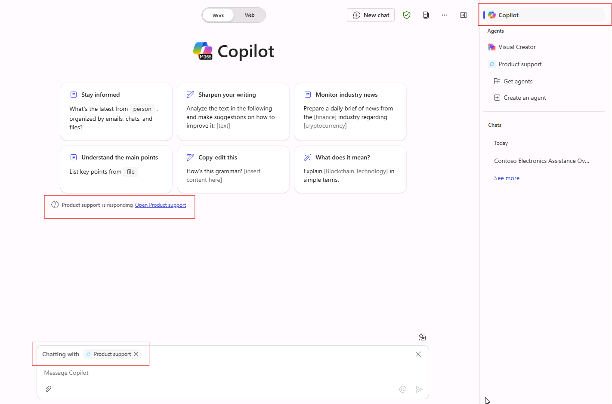

---
lab:
  title: '1.1: Crear un agente declarativo'
---

# Crear un agente declarativo

En este ejercicio crearás un agente declarativo mediante IA generativa, mejorarás las instrucciones, publicarás el agente en Microsoft 365 y lo probarás en Microsoft 365 Copilot.

Este ejercicio debería tardar aproximadamente **20** minutos en completarse.

## Crear un agente declarativo mediante IA generativa

Empieza por crear un nuevo agente declarativo en Copilot Studio. Usa la IA generativa para redactar las instrucciones y las propiedades del agente.

1. En un explorador web, ve a [Microsoft Copilot Studio](https://copilotstudio.microsoft.com/) en `https://copilotstudio.microsoft.com`.
1. Inicia sesión con una cuenta profesional o educativa en la que tengas permiso para crear en Copilot Studio.
1. Si se te solicita en la página **Bienvenido a Microsoft Copilot Studio**, elige tu país o región y selecciona **Comenzar**.
1. Si te aparece el elemento emergente **Bienvenida a Copilot Studio**, selecciona **Omitir**.
1. Cuando llegues a Copilot Studio, es probable que empieces en la interfaz conversacional para crear un nuevo agente. Este asistente te ayuda a configurar un *agente personalizado*.  Selecciona **...** y, después, selecciona **Cancelar creación del agente** para salir de este asistente.  Selecciona **Salir** para confirmar.

    

1. Ve a **Agentes** en el panel de navegación izquierdo.
1. Selecciona **Microsoft 365 Copilot** en la página del agente.
1. En la página agente de **Microsoft 365 Copilot**, selecciona **Agregar** en la sección Agentes.

    

    Se te envía a la experiencia de creación conversacional donde puedes describir el agente que deseas crear.

1. Se te pide que describas lo que quieres que haga el agente.  En el cuadro de texto **Escribir el mensaje** en la interfaz conversacional, escribe lo siguiente:

    ```md
    I'd like to create a product support agent that answers questions related to Contoso Electronics products.
    ```

1. Selecciona **Entrar** o **Enviar** para enviar el mensaje.
1. Si se te pide que sugieras un nombre para el agente, escribe `Product support` y envía el mensaje.
1. Selecciona **Omitir para configurar** en la parte superior de la interfaz conversacional para ver la página de información general del agente y revisar lo que ha configurado la IA generativa hasta el momento.

## Configurar el agente y definir las instrucciones

A continuación, actualiza manualmente las propiedades y los metadatos del agente.

1. Revisa el **nombre** que definió el asistente para IA generativa para el agente. Actualiza el nombre para asegurarte de que es `Product support`.
1. Actualiza la propiedad **description** a `A product support agent that can answer queries about Contoso Electronics products`.
1. En el cuadro de texto **Instrucciones**, escribe:
  
    ```md
        You are an agent tasked with answering questions about Contoso Electronics products. Start every response to the user with "Thanks for using a Copilot agent!\n\n" and then answer the questions and help the user.
    ```

1. Selecciona **Crear** en la parte superior de la página para crear el agente.  Después de unos instantes, se te dirigirá a la página de información general del agente.

## Probar el agente en Copilot Studio

A continuación, prueba el comportamiento del agente en el panel de pruebas de Copilot Studio antes de publicarlo en Microsoft 365 Copilot.

1. En la página de información general del agente de **soporte técnico del producto**, observa en la sección **Publicar detalles** que el agente aún no está publicado.

    

1. Si el panel **Probar el agente** no se muestra a la derecha de la información general del agente, selecciona el botón **Probar** situado junto al botón Publicar para abrir el panel de pruebas.
1. En el cuadro de texto, escribe `What can you do?` y envía el mensaje.
1. Espera la respuesta. Observa cómo comienza la respuesta con el texto "¡Gracias por usar un agente de Copilot!" como indicaste anteriormente en las instrucciones que definiste para el agente.

    

    Observa también que el agente tiene actualmente instrucciones, pero aún no tiene ninguna acción u orígenes de conocimiento personalizados. Todavía no has configurado el agente para responder a preguntas sobre los productos de Contoso. Lo harás en el ejercicio siguiente.

    > [!NOTE]
    > Si necesitas editar el agente, cierra el panel de pruebas y selecciona **Editar** en la sección **Detalles** de la página de información general del agente. Antes de volver a probar, selecciona el botón **Actualizar** dentro del panel de pruebas para cargar los cambios más recientes.

## Publicar el agente en Microsoft 365 Copilot

A continuación, publica el agente declarativo en Microsoft 365 Copilot. En la página de información general del agente de **soporte técnico del producto**:

1. Seleccione el botón **Publicar**. Se te pedirá que escribas la información sobre el agente que se mostrará a los usuarios en Microsoft 365 Copilot y Microsoft Teams.

    > [!NOTE]
    > La información de este formulario se usa para rellenar la entrada de catálogo en los catálogos de Office y Teams de tu organización y en la lista aplicaciones integradas del Centro de administración de Microsoft. El modelo de lenguaje de Microsoft 365 Copilot no lo usa para invocar al agente.

1. Escribe `Answers questions about Contoso Electronics products` en el cuadro de texto **Descripción breve**.
1. Acepta las sugerencias predeterminadas del resto de campos.
1. Seleccione **Publicar**.
1. Espera a que se publique el agente.  No cierres la ventana modal durante la publicación. Esta operación puede tardar unos minutos.

    > [!NOTE]
    > Al seleccionar Publicar, se aprovisiona el recurso de bot correspondiente al agente en el entorno de Microsoft Entra ID del inquilino. El recurso permite a los usuarios interactuar con el agente en Microsoft Teams.

1. Una vez publicado el agente, aparece la ventana **Opciones de disponibilidad**.
1. En **Compartir vínculo**, selecciona **Copiar** para copiar el vínculo para compartir del agente y, después, selecciona **Listo**.
1. Observa que la sección **Publicar detalles** de la página de información general del agente refleja que se ha publicado el agente.

    

    Si necesitas volver a copiar Compartir vínculo, selecciona **Opciones de disponibilidad** en la sección **Publicar detalles**.

1. Abre una nueva pestaña en el explorador web, pega el vínculo para compartir en la barra de direcciones URL y, después, selecciona **Entrar**. Aparece una ventana modal con la información general del agente. Esto muestra la información orientada al usuario que proporcionaste sobre el agente durante la publicación, así como los permisos necesarios para el agente.

    

1. Selecciona **Agregar** para agregar el agente a Microsoft 365 Copilot.
1. Espera a que se agregue el agente. El agente se inicia en Microsoft 365 Copilot.

## Probar el agente en Microsoft 365 Copilot

A continuación, vamos a ejecutar el agente declarativo en Microsoft 365 Copilot y validar su funcionalidad tanto en la experiencia **en contexto** como en la experiencia **envolvente**.

Siguiendo los pasos anteriores, actualmente estás en la experiencia **envolvente** del agente. Observe que, en el panel **Agentes** situado junto a la interfaz de chat, **Soporte técnico del producto** está seleccionado como el agente con el que chatea directamente.


1. En el cuadro de texto, escribe `What can you do?` y envía el mensaje.
1. Envía el mensaje y espera la respuesta. Observa cómo comienza la respuesta con el texto "¡Gracias por tu pregunta!" siguiendo la guía que proporcionaste en las instrucciones del agente.

Seguimos en el explorador, donde probaremos la experiencia **en contexto**.

1. Encima del panel **Agentes** de la barra lateral, seleccione **Chat** o **M365 Copilot** para salir del chat envolvente con el agente **Soporte técnico del producto** y chatear con Microsoft 365 Copilot.

    

1. En el cuadro de mensaje, escribe el símbolo <kbd>@</kbd>. Aparece un control flotante con la lista de agentes disponibles.

    

1. En el control flotante, selecciona **Soporte técnico del producto**. Observa el mensaje de estado situado encima del cuadro de mensaje. Muestra **Hablando con el soporte técnico del producto**, lo que significa que usa la experiencia en contexto del agente.

    

1. En el cuadro de texto, escribe `What can you do?` y envía el mensaje.

1. Espera la respuesta. Observa cómo comienza la respuesta con el texto "¡Gracias por tu pregunta!" siguiendo la guía que proporcionaste en las instrucciones del agente.

1. Para salir de la experiencia en contexto, selecciona la cruz (X) en el mensaje de estado. Observa que se quita el mensaje de estado y se muestra un mensaje en la ventana de chat que indica que ya no estás chateando con el agente.

    

Ahora has probado el agente tanto en la experiencia envolvente como en la experiencia en contexto en Microsoft 365 Copilot.
